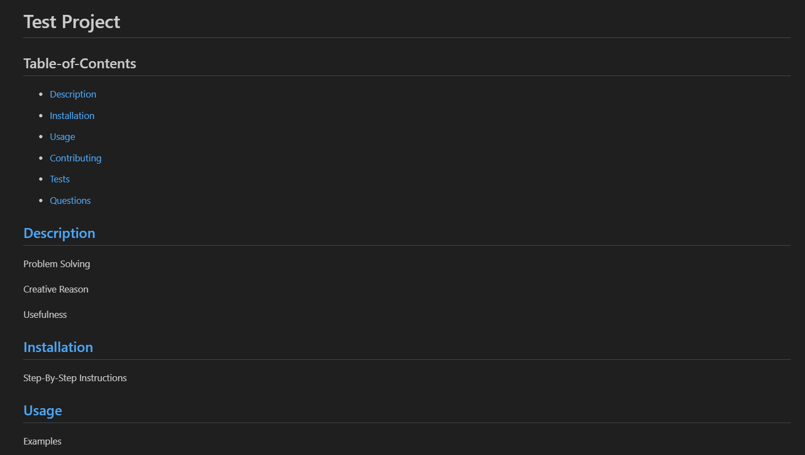
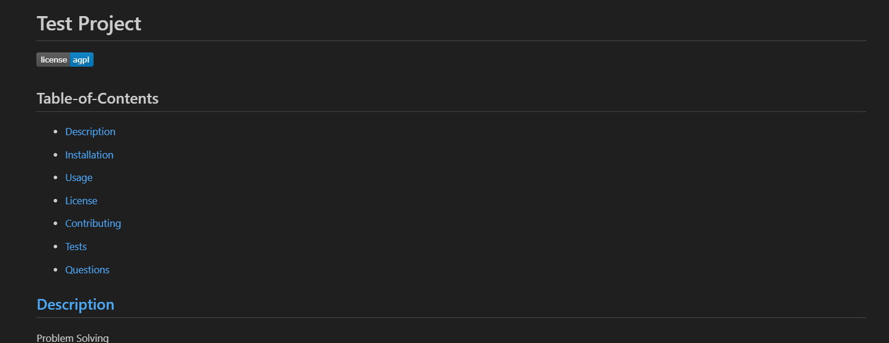
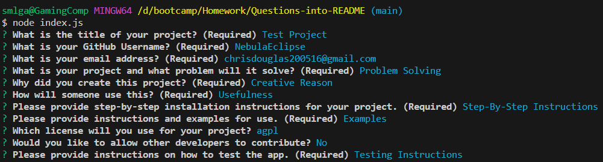
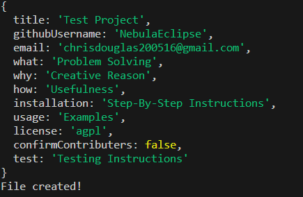

# 09 Node.js Challenge: Professional README Generator
## Table-of-Contents

  * [Description](#description)
  * [Installation](#installation)
  * [Usage](#usage)
   
  * [Contributing](#contributing)
  * [Tests](#tests)
  * [Questions](#questions)
  
  ## [Description](#table-of-contents)

  The project will help a user generate a README without having to worry about applying proper mark down syntax.

  This README generator will allow the user to answer a series of specific questions and create a professional complete README based on their responses. It will provide the developer with the ability to make their project complete and more professional, increasing the likely hood that someone will want to use their app over similar apps without a README.

  ## [Installation](#table-of-contents)

  Click the repository link below. Download the zip file and copy it to a directory of your choice and or clone to a directory of your choice using your terminal.  Open the file in VS Code or whatever editor you work with. Open the terminal in VS Code and make sure you’re in the root directory README-Generator. You’ll now be ready to run the app!

  [README Generator Download Link](https://github.com/NebulaEclipse/README-generator/)
  
  README Screenshot No License
  
  
  README Screenshot with License
  

  ## [Usage](#table-of-contents)

  After installation is complete, run the following code: ‘node index.js’ in the terminal. Answer all of the prompts and after completion, you should see a console log showing your answers to your prompts, a message that says ‘File created!’, and you should see your file under the ‘README-Generated’ folder called ‘generated-README.md’. It’s generated in mark down syntax so you can copy and paste that code into your project!
 
  Terminal Questions
  

  Terminal After Completing the Questions
  
  
  For more information on how to add screenshots for examples, visit the following website:
  
  [Mark Down Tutorial](https://agea.github.io/tutorial.md/)

  ## [Tests](#table-of-contents)

  To test this app, open up the file in VS Code. Open the terminal, change directory into the root folder ‘README-Generator’, and run ‘node index.js’. Answer the prompts and view the preview of the ‘generated-README.md’ file in the ‘README-Generated’ folder.

  ## [Questions](#table-of-contents)

  Please contact me using the following links:

  [GitHub](https://github.com/NebulaEclipse)

  [Email: chrisdouglas200516@gmail.com](mailto:chrisdouglas200516@gmail.com)